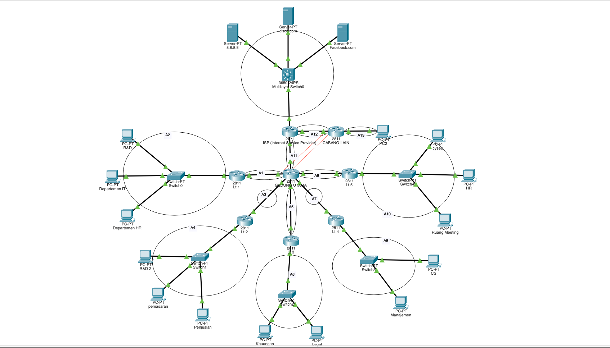
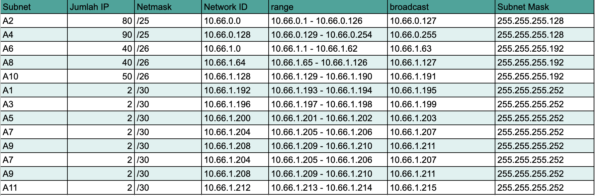
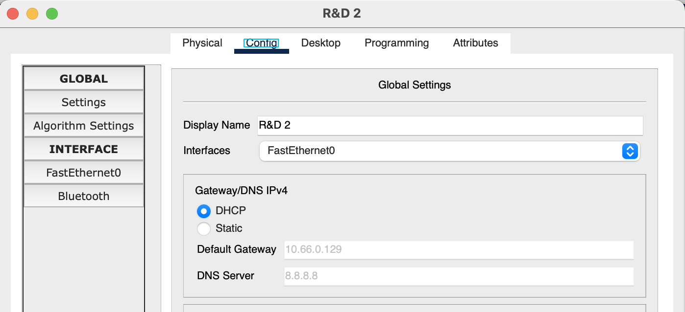

# Laporan Final Project Jarkom

| Nama | NRP |
| ---- | :-: |
| Chelsea Vania | 5027231006 |
| Fiorenza Adelia Nalle | 5027231053 |
| Adlya Isriena Aftarisya | 5027231066 |
| Harwinda | 5027231079 |

## Topologi dan Subnetting


## Pembagian IP


## Konfigurasi
### Router Gedung Utama
Interfaces
```
interface FastEthernet0/0
 ip address 10.66.1.213 255.255.255.252
 no shut

interface FastEthernet0/1
 ip address 10.66.1.193 255.255.255.252
 no shut
 
interface Ethernet0/1/0
 ip address 10.66.1.205 255.255.255.252
 no shut
 
interface Ethernet0/2/0
 ip address 10.66.1.209 255.255.255.252
 no shut
 
interface FastEthernet1/0
 ip address 10.66.1.197 255.255.255.252
 no shut
 
interface FastEthernet1/1
 ip address 10.66.1.201 255.255.255.252
 no shut
```
Static Routes
```
ip route 10.66.0.0 255.255.255.128 10.66.1.194 
ip route 10.66.1.0 255.255.255.192 10.66.1.202 
ip route 10.66.1.64 255.255.255.192 10.66.1.206 
ip route 10.66.1.128 255.255.255.192 10.66.1.210 
ip route 10.66.0.128 255.255.255.128 10.66.1.198 
ip route 10.66.3.0 255.255.255.0 10.66.4.2 
ip route 10.66.3.0 255.255.255.0 10.66.1.214 
ip route 10.66.2.0 255.255.255.252 10.66.1.214 
```
### Router Lt 1
Interfaces
```
interface FastEthernet0/0
 ip address 10.66.1.194 255.255.255.252
 no shut
 
interface FastEthernet0/1
 ip address 10.66.0.1 255.255.255.128
 no shut
```
Static Routes
```
ip route 10.66.0.128 255.255.255.128 10.66.1.193 
ip route 10.66.1.0 255.255.255.192 10.66.1.193 
ip route 10.66.1.64 255.255.255.192 10.66.1.193 
ip route 10.66.1.128 255.255.255.192 10.66.1.193 
ip route 10.66.1.196 255.255.255.252 10.66.1.193 
ip route 10.66.1.200 255.255.255.252 10.66.1.193 
ip route 10.66.1.204 255.255.255.252 10.66.1.193 
ip route 10.66.1.208 255.255.255.252 10.66.1.193 
ip route 10.66.2.0 255.255.255.252 10.66.1.193 
ip route 10.66.1.212 255.255.255.252 10.66.1.193 
ip route 10.66.3.0 255.255.255.192 10.66.1.193 
```
### Route Lt 2
Interfaces
```
interface FastEthernet0/0
 ip address 10.66.1.198 255.255.255.252
 no shut

interface FastEthernet0/1
 ip address 10.66.0.129 255.255.255.128
 no shut
```
Static Routes
```
ip route 10.66.0.0 255.255.255.128 10.66.1.197 
ip route 10.66.1.0 255.255.255.192 10.66.1.197 
ip route 10.66.1.64 255.255.255.192 10.66.1.197 
ip route 10.66.1.128 255.255.255.192 10.66.1.197 
ip route 10.66.1.192 255.255.255.252 10.66.1.197 
ip route 10.66.1.200 255.255.255.252 10.66.1.197 
ip route 10.66.1.204 255.255.255.252 10.66.1.197 
ip route 10.66.1.208 255.255.255.252 10.66.1.197 
ip route 10.66.1.212 255.255.255.252 10.66.1.197 
ip route 10.66.2.0 255.255.255.252 10.66.1.197 
ip route 10.66.3.0 255.255.255.192 10.66.1.197 
```
### Route Lt 3
Interfaces
```
interface FastEthernet0/0
 ip address 10.66.1.202 255.255.255.252
 no shut

interface FastEthernet0/1
 ip address 10.66.1.1 255.255.255.192
 no shut
```
Static Routes
```
ip route 10.66.0.0 255.255.255.128 10.66.1.201 
ip route 10.66.0.128 255.255.255.128 10.66.1.201 
ip route 10.66.1.64 255.255.255.192 10.66.1.201 
ip route 10.66.1.128 255.255.255.192 10.66.1.201 
ip route 10.66.1.192 255.255.255.252 10.66.1.201 
ip route 10.66.1.196 255.255.255.252 10.66.1.201 
ip route 10.66.1.204 255.255.255.252 10.66.1.201 
ip route 10.66.1.208 255.255.255.252 10.66.1.201 
ip route 8.8.8.0 255.255.255.0 10.66.1.201 
ip route 10.66.1.212 255.255.255.252 10.66.1.201 
ip route 10.66.2.0 255.255.255.252 10.66.1.201 
ip route 10.66.3.0 255.255.255.192 10.66.1.201 
```
### Route Lt 4
Interfaces
```
interface FastEthernet0/0
 ip address 10.66.1.206 255.255.255.252
 no shut 

interface FastEthernet0/1
 ip address 10.66.1.65 255.255.255.192
 no shut
```
Static Routes
```
ip route 10.66.0.0 255.255.255.128 10.66.1.205 
ip route 10.66.0.128 255.255.255.128 10.66.1.205 
ip route 10.66.1.0 255.255.255.192 10.66.1.205 
ip route 10.66.1.128 255.255.255.192 10.66.1.205 
ip route 10.66.1.192 255.255.255.252 10.66.1.205 
ip route 10.66.1.196 255.255.255.252 10.66.1.205 
ip route 10.66.1.200 255.255.255.252 10.66.1.205 
ip route 10.66.1.208 255.255.255.252 10.66.1.205 
ip route 10.66.1.212 255.255.255.252 10.66.1.205 
ip route 10.66.2.0 255.255.255.252 10.66.1.205 
ip route 10.66.3.0 255.255.255.192 10.66.1.205 
```
### Route Lt 5
Interfaces
```
interface FastEthernet0/0
 ip address 10.66.1.210 255.255.255.252
 no shut

interface FastEthernet0/1
 ip address 10.66.1.129 255.255.255.192
 no shut
```
Static Routes
```
ip route 10.66.0.0 255.255.255.128 10.66.1.209 
ip route 10.66.0.128 255.255.255.128 10.66.1.209 
ip route 10.66.1.0 255.255.255.192 10.66.1.209 
ip route 10.66.1.64 255.255.255.192 10.66.1.209 
ip route 10.66.1.192 255.255.255.252 10.66.1.209 
ip route 10.66.1.196 255.255.255.252 10.66.1.209 
ip route 10.66.1.200 255.255.255.252 10.66.1.209 
ip route 10.66.1.204 255.255.255.252 10.66.1.209 
ip route 10.66.1.212 255.255.255.252 10.66.1.209 
ip route 10.66.2.0 255.255.255.252 10.66.1.209 
ip route 10.66.3.0 255.255.255.192 10.66.1.209 
```

## Konfigurasi DHCP
> Departemen R&D, Pemasaran, dan Penjualan akan menggunakan DHCP untuk mengalokasikan alamat IP secara dinamis kepada perangkat mereka. Konfigurasikan DHCP server pada router dan pastikan perangkat di tiga departemen tersebut mendapatkan IP otomatis sesuai dengan rentang yang telah ditentukan. 

### Router Lt 2
```
ip dhcp pool A4
network 10.66.0.128 255.255.255.128
default-router 10.66.0.129
dns-server 8.8.8.8
```

### R&D, Pemasaran, Penjualan


Ubah konfigurasi IP dari static ke DHCP agar dapat mendapatkan IP address dari DHCP server

